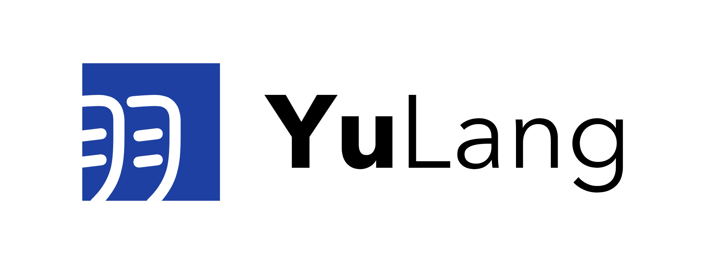

# Yu Documentation

This repository contains all documentations about the Yu programming language.

## Documentations

* YuLang tutorial: [中文版 (GitHub)](?), [中文版 (Gitee)](?).

## Changelog

See [CHANGELOG.md](CHANGELOG.md)

## License

Copyright (C) 2010-2021 MaxXing. License CC BY-NC-ND 4.0.
